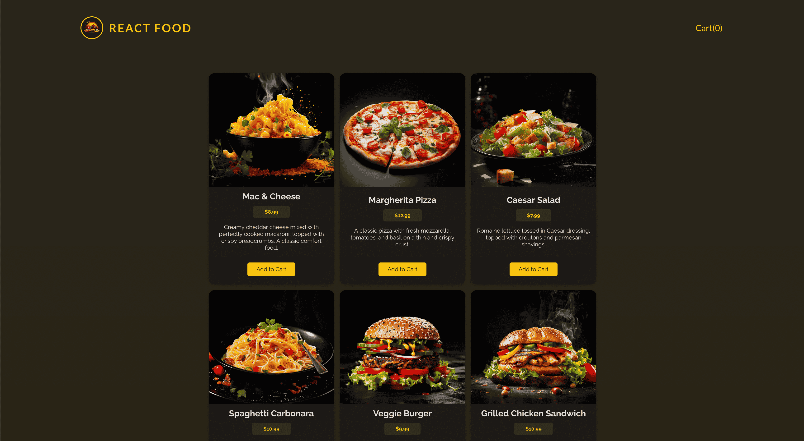
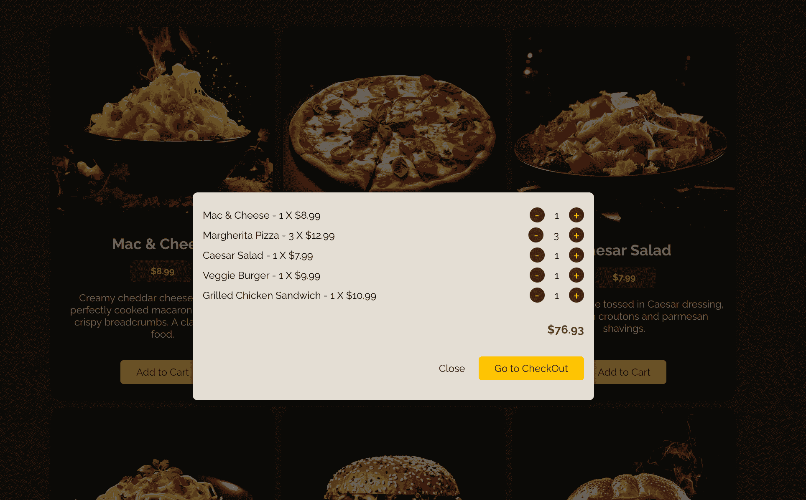

# React Food Ordering App

This is a full-stack web application for browsing and ordering meals. It features a modern React frontend built with Vite and a simple, robust Node.js and Express backend.

## Live Demo

[**View the live application here!**](https://food-ordering-react-green.vercel.app/)

## Screenshots

*A preview of the main meals page.*

<!-- TODO: Add a screenshot of the main application view -->


*The shopping cart modal.*

<!-- TODO: Add a screenshot of the shopping cart -->


*The checkout form.*

<!-- TODO: Add a screenshot of the checkout form -->


---

## Features

- **Browse Meals:** Fetches and displays a list of available meals from the backend.
- **Dynamic Shopping Cart:** Add and remove items from the cart with real-time quantity and price updates.
- **State Management:** Utilizes React's `useContext` and `useReducer` for clean and efficient global state management (cart and user progress).
- **Asynchronous Operations:** Custom `useHttp` hook for handling GET and POST requests to the backend.
- **Modern Form Handling:** Uses the `useActionState` hook for managing form submission and state in the checkout process.
- **Responsive UI:** Clean and simple user interface.
- **Error Handling:** Displays user-friendly error messages for failed HTTP requests.

## Tech Stack

- **Frontend:**
  - React
  - Vite
  - React Hooks (`useContext`, `useReducer`, `useActionState`, `useEffect`)

- **Backend:**
  - Node.js
  - Express.js
  - `body-parser` for request parsing
  - `fs` module for reading/writing local JSON data

---

## Getting Started

Follow these instructions to get a copy of the project up and running on your local machine for development and testing purposes.

### Prerequisites

You need to have Node.js (which includes npm) installed on your system.

### Installation & Setup

1.  **Clone the repository:**
    ```bash
    git clone <your-repository-url>
    cd <repository-folder>
    ```

2.  **Install Backend Dependencies:**
    Navigate to the backend directory and install the required npm packages.
    ```bash
    cd backend
    npm install
    ```

3.  **Install Frontend Dependencies:**
    Navigate back to the root and then to the frontend directory to install its dependencies.
    ```bash
    cd ../
    npm install
    ```

### Running the Application

1.  **Start the Backend Server:**
    In the `backend` directory, run the following command. The server will start on `http://localhost:3000`.
    ```bash
    node app.js
    ```

2.  **Start the Frontend Development Server:**
    In the project's root directory (where the `src` folder is), run the following command. The Vite dev server will start, typically on `http://localhost:5173`.
    ```bash
    npm run dev
    ```

Open your browser and navigate to `http://localhost:5173` to see the application in action!